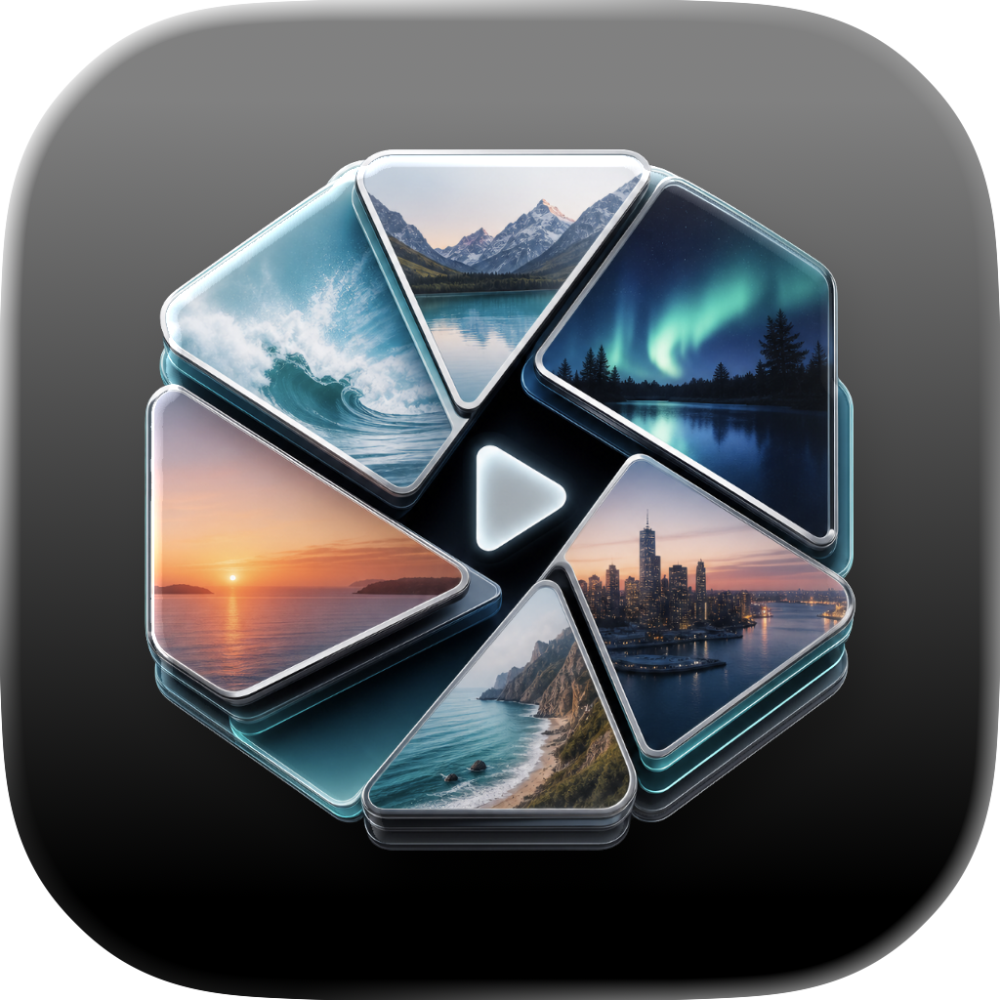
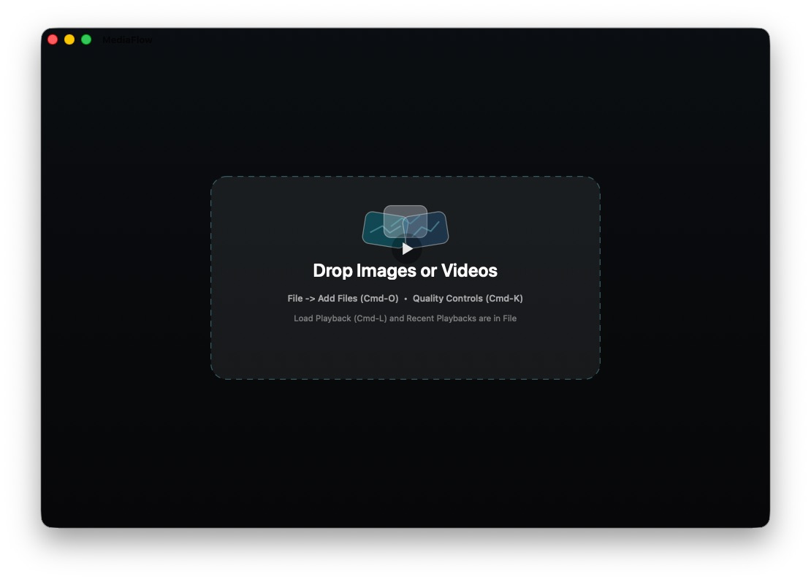

# MediaFlow

<div align="center">



**A native macOS canvas for building live image/video walls, collages, and comparison layouts.**


[](LICENSE)

</div>

<p align="center">
  
</p>

MediaFlow is a Metal-backed macOS app for turning a TV, spare monitor, or unused screen into a fullscreen live image and video wall. Add a larger library of local photos and videos than can fit on screen, choose how many items should be visible at once, and use different wall, collage, strip, and comparison layouts while keeping the canvas filled edge-to-edge.

<p align="center">
  
</p>

<p align="center">
  
</p>

The app is designed for ambient local playback, live walls, and visual comparison across mixed media: a floating Flow Library, drag-and-drop and picker ingest, Photos import, round-robin or random rotation, optional duplicate random slots, video looping, per-item rotation, per-item speed controls, A-B segments, crop-as-zone layout, Metal quality diagnostics, frame interpolation, denoise, tone recovery, and saved encrypted playback layouts.

## Features

- Native AppKit + Metal rendering for photos and videos on a fullscreen TV, spare screen, live media wall, or comparison layout.
- Floating **Flow Library** for keeping a larger media pool available without forcing every item onto the visible wall.
- Drag-and-drop ingest, **File -> Add Files...**, **File -> Add From Photos...**, and Finder **Open With** registration for images and videos.
- Configurable maximum visible items so the screen stays readable even when the library is much larger.
- Round-robin and random rotation modes for cycling library items through the visible wall.
- Optional duplicate random slots, allowing the same source to appear in more than one visible slot during random rotation.
- Edge-to-edge collage layout that recalculates when items are added, removed, rotated, resized, reordered, cropped, or when the window changes size.
- Full content visible by default. Cropping happens only when explicitly requested.
- Per-item crop zones, pan, zoom, and layout weights.
- Video loop playback, pause/play, mute, volume, speed, timeline scrubbing, and multiple A-B loop segments.
- Global freeze/resume with `Space`, preserving each video's own state.
- Metal quality modes: Best, Linear, Nearest, Bicubic, and Lanczos 2.
- Optional frame interpolation for slower-than-1x playback.
- Optional Natural Denoise + Detail, Tone Recovery, Magic Rescue, and split compare.
- Encrypted `.ivplayback` save/load with recent playbacks and a manual last-closed-session restore.
- App menu dialogs for **About MediaFlow**, **What's New**, and **Check for Updates**.
- Generated production `.app` and DMG installer scripts.

## Installation

### Download a DMG

For public distribution, attach the DMG produced by `./scripts/create-dmg.sh` to a GitHub Release and install from there:

1. Open the DMG.
2. Drag `MediaFlow.app` to `Applications`.
3. Launch from Applications or Spotlight.
4. If macOS warns about an unidentified developer, see the signing notes in [BUILD.md](BUILD.md).

### Build From Source

Requirements:

- A macOS release compatible with `Package.swift`
- Xcode command line tools
- A Swift toolchain compatible with `Package.swift`

Build the app bundle:

```sh
./scripts/build-native-app.sh
```

Create the DMG installer:

```sh
./scripts/create-dmg.sh
```

Verify the latest DMG:

```sh
./scripts/verify-dmg.sh
```

The generated installer is written under `dmg_output/`; its filename is derived from the app bundle version.
The DMG script writes a Finder layout with a hidden `.background/dmg-background.png`, a MediaFlow-colored drag arrow, `MediaFlow.app`, and an `Applications` symlink. Set `SKIP_FINDER_LAYOUT=true` only if Finder AppleScript is blocked in automation.

For public distribution, sign with Developer ID and notarize. The exact commands are documented in [BUILD.md](BUILD.md).

### Updates

MediaFlow checks GitHub Releases from **MediaFlow -> Check for Updates...** and can self-install a release asset that contains `MediaFlow.app` (`.dmg` or `.zip`). Attach the DMG from `dmg_output/` to the matching GitHub Release.

While the GitHub repository is private, update checks need a `MEDIAFLOW_GITHUB_TOKEN` or `GITHUB_TOKEN` in the app environment. After the repository is public, no token is needed.

## Quick Start

1. Open `MediaFlow.app`.
2. Drop photos or videos onto the window, use **File -> Add Files...**, choose **File -> Add From Photos...**, or choose **Open With -> MediaFlow** in Finder.
3. Use the floating **Flow Library** to keep more media available than the wall currently shows.
4. Set the maximum visible item count and choose round-robin or random rotation for a TV/spare-screen memory wall.
5. Click an item to select it.
6. Use menus and hotkeys for layout, crop, playback, and quality controls.
7. Save reusable layouts with **File -> Save Playback...**.

## Flow Library And Rotation

- The floating **Flow Library** keeps the full media pool available while the wall shows only the current visible set.
- The maximum visible item count controls how dense the wall gets on a TV or spare screen.
- Round-robin rotation walks through the library predictably.
- Random rotation shuffles the visible set for ambient playback.
- Duplicate random slots can intentionally show the same source in multiple visible positions.

## Hotkeys

| Key | Action |
| --- | --- |
| `Q` | Quit immediately |
| `Space` | Freeze / resume all videos |
| `Esc` | Exit fullscreen first; otherwise clear selection, crop, or pan |
| `Del` / `Backspace` | Remove the selected item |
| `+` / `-` | Enlarge / reduce the selected item, or the item under the pointer |
| `Z` | Toggle Crop |
| `P` | Pan the selected cropped or zoomed item |
| `M` | Cycle Metal quality mode |
| `Left` / `Right` | Seek the hovered or selected video by 10 seconds |
| `Up` / `Down` | Adjust hovered or selected video speed |
| `1` / `2` / `0` | Set A, set B, clear A-B for the hovered or selected video |

Hotkeys are handled by physical key position, so they keep working under non-Latin keyboard layouts.

## Mouse Gestures

- Click an item to select it; click the selected item again to clear selection and hide its controls.
- Drag files onto the canvas to add them to the wall and Flow Library.
- Drag a cropped or zoomed item to pan its visible area.
- Shift-drag an item over another to reorder layout.
- Mouse wheel over an item zooms it, clamped to 100% minimum.
- Enable optional hover tools from **View -> Show Hover Item Tools**.
- Rotate items with **Item -> Rotate Left/Right/180** or `[` / `]` / `R`.
- Use **Crop** then drag a rectangle, or Option-drag an item directly, to apply a crop aspect to that item.

## Save And Load

- `.ivplayback` files store local file paths, crop, pan, zoom, rotation, layout weights, video speed, volume, mute state, and A-B loops.
- Saved playbacks preserve the Flow Library, maximum visible item count, rotation mode, and duplicate-random-slot preference.
- Playback files are encrypted, but the app currently uses an embedded key. This prevents plain JSON on disk, not reverse-engineering by someone with the binary.
- Recent playbacks appear under **File -> Recent Playbacks**.
- MediaFlow opens to a clean canvas by default.
- The last non-empty playback is saved automatically on quit, restored with **File -> Open Last Closed Session**, and removed with **File -> Forget Last Closed Session**.
- Per-file A-B histories and quality profiles are stored in `~/Library/Application Support/MediaFlow/`.

## Architecture

```text
.
├── Assets/                         App icon source and generated icon assets
├── Sources/ImageViewerNative/      AppKit, Metal, AVFoundation, menus, save/load
├── scripts/build-native-app.sh     Release app bundle builder
├── scripts/create-dmg.sh           DMG installer builder
├── scripts/notarize.sh             Apple notarization helper
├── scripts/verify-dmg.sh           DMG structure/signing verifier
├── BUILD.md                        Build, release, and project memory notes
└── STATUS.md                       Implementation status and known limitations
```

The SwiftPM package and target still use the internal `ImageViewerNative` name. The distributed macOS app name is `MediaFlow`.

## Release Notes

See [CHANGELOG.md](CHANGELOG.md) for versioned release notes.

## Repository Notes

- MediaFlow is licensed under MIT.
- Generated `.app` bundles are ignored. Build them locally or download release artifacts.
- Keep `dmg_output/` ignored and upload DMGs to Releases.
- If distributing beyond local testing, use Developer ID signing and notarization instead of ad-hoc signing.
- Review `STATUS.md` for anything too internal before exposing the repository.
